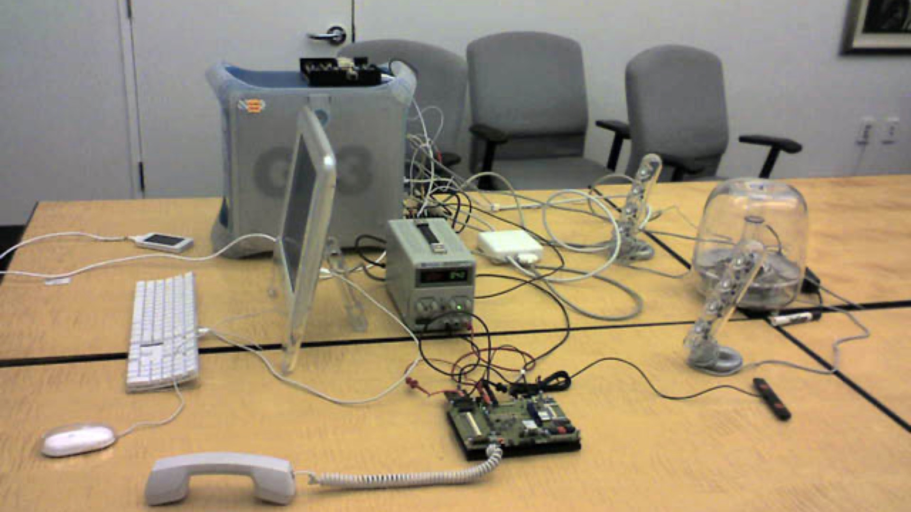

## Experience Ken Kocienda's early iteration of the original iPhone keyboard: the Blob Keyboard

Go back to september 2005 in the secret zone where 15 developers were building iPhone's OS and grab the weird prototype of the iPhone keyboard 🤓

#### Work on desktop, but meant for mobile and touchscreen! (closer to the original experience)

### Backstory of this reconstruction

I’m teaching a tech design history course in Paris, sharing the history of the mouse, the GUI, the iPhone, even the Newton, and much more with hundreds of design students 

(and I'm opening this as a [workshop for UX/UI design professionals](http://juliendorra.com/atelier-histoire-ux/en/) too!).

Ken Kocienda's keyboard development for the iPhone is **one of the key innovation stories** of my course.

### The Blob Keyboard: innovation is not a straight line

The Blob Keyboard is the first iteration of what would become the iPhone touchscreen keyboard. 

The Blob Keyboard was born out of necessity, **following a total UX crisis** brought upon the team because of the unknown unknows of creating a keyboard on a small piece of glass. 

Read more about it [in this interview](https://qz.com/1380188/ken-kocienda-qa) or even better in [Kocienda's book Creative Selection](http://creativeselection.io).

### Why build this?

Every year I make my tech design history class **even more tangible** by using **props, manuals, packaging, demos, and real vintage device hands-on**. This gives the the students a chance to really understand how devices like, for example, the first iPhone 2G were experienced. 

But manipulating the final, keyboard shipped experience is not telling you **the whole design story**.

**So I had this crazy idea:** let's build a Blob Keyboard simulator 😅 so they can *feel* the design iterations.

I iterated and got feedbacks and guidance from [Ken Kocienda on Bluesky](https://bsky.app/profile/kocienda.bsky.social) to get as close to the original prototype as possible.

### I want to play with it!

You can test it here: [Blob Keyboard web demo](https://juliendorra.github.io/blob-keyboard-simulator/blob-keyboard-simulator.html)

It work with a touchpad or mouse on a computer, but it's meant for mobile and touchscreen! That way it's much closer to the original experience.

It's like going back in time, grabbing the wallaby touch display on Kocienda's desk (see below!) and trying the first demo of what would become the iPhone keyboard.

Source: [conversation on bluesky](https://bsky.app/profile/kocienda.bsky.social/post/3llw4fa25tc2u)

### Wow, it's weird!

Here are the limitations of the original prototype as explained by Ken Kocienda:

 - Moving the cursor didn't exist at the time of this demo. It came later with the loupe.
 - There was no backspace. You couldn't delete or go back.
 - No capitals or numbers either.
 - No animation. Pressed keys just popped, but your eye filled in the details and it felt like it “moved” because of the shapes.

In addition it's **not** a QWERTY keyboard! The iPhone team actually tried to get us out of QWERTY but ultimately decided that iPhone's keyboard needed familiarity to be successful.

### Reference images used

From Ken Kocienda's book:

Ken Kocienda shared a more detailled version:

Source: [conversation on bluesky](https://bsky.app/profile/kocienda.bsky.social/post/3llmuxfgud22i)

