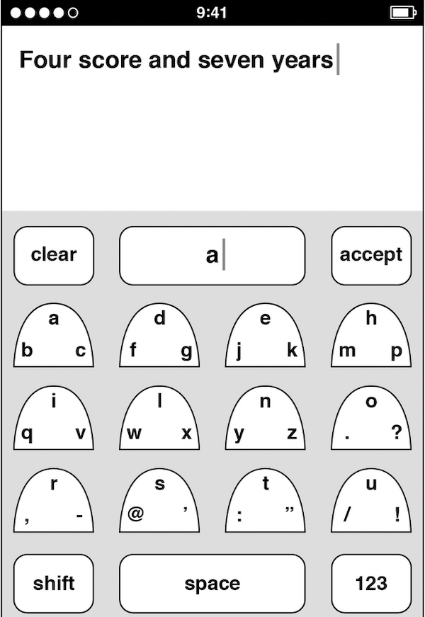

### Experience Ken Kocienda's early iteration of the original iPhone keyboard.

**[work in progress]**

I’m teaching a tech design history course in Paris, sharing the history of the mouse, the GUI, the iPhone, even the Newton, and much more with hundreds of design students (and soon UX/UI design professionals too!).

Ken Kocienda's keyboard development for the iPhone is one of the key innovation stories of my course.

The blob keyboard is the first iteration of what would become the iPhone touchscreen keyboard. The blob keyboard was born out of necessity, following a total UX crisis brought upon the team because of the unknown unknows of creating a keyboard on a small piece of glass.

Each year, I make the class even more tangible with props, demos, and real vintage device hands-on. This gives the the students a chance to really understand how device like the first iPhone 2G worked. 

So I had this crazy idea: let's build a Blob Keyboard simulator 😅 so they can *feel* the design iterations

From Ken Kocienda's book:

Ken Kocienda shared a more detailled version:

